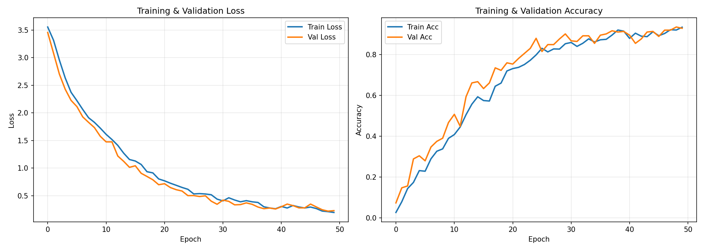

# ASL Fingerspelling Recognition (LSTM)

Real-time American Sign Language (ASL) fingerspelling recognition using an LSTM neural network and MediaPipe hand landmarks. Detects hand signs from a webcam feed and converts them to text.

## Features

- **36 classes**: Recognizes letters `a`–`z` and digits `0`–`9`
- **Real-time inference**: Live webcam feed with hand landmark visualization
- **Text accumulation**: Automatically commits stable predictions to build words
- **LSTM architecture**: Two-layer LSTM with dropout for temporal sequence classification

## Model Architecture

```mermaid
graph LR
    subgraph Input Pipeline
        A["Webcam / Image"] --> B["MediaPipe<br/>HandLandmarker"]
        B --> C["21 Landmarks<br/>(x, y, z)"]
        C --> D["Normalize<br/>Wrist-center + Scale"]
        D --> E["63 Features"]
    end

    subgraph LSTM Model
        E --> F["Sequence Buffer<br/>10 frames × 63"]
        F --> G["LSTM Layer 1<br/>hidden=128"]
        G --> H["Dropout 0.3"]
        H --> I["LSTM Layer 2<br/>hidden=64"]
        I --> J["Dropout 0.3"]
        J --> K["Last Timestep"]
        K --> L["Dense 64 + ReLU"]
        L --> M["Dense 36 + Softmax"]
    end

    subgraph Output
        M --> N["Predicted Letter<br/>(a-z, 0-9)"]
        N --> O["Stability Filter<br/>15 frames"]
        O --> P["Accumulated Text"]
    end
```



- **Input**: Sequence of 10 frames × 63 features (21 landmarks × 3 coordinates)
- **Output**: Probability distribution over 36 classes
- **Parameters**: ~135K total

## Project Structure

```
lstm/
├── asl_dataset/            # Training images organized by class (a-z, 0-9)
│   ├── a/
│   ├── b/
│   └── ...
├── data/                   # Preprocessed data (generated)
│   ├── landmarks.npy       # (N, 63) normalized landmark features
│   ├── labels.npy          # (N,) integer labels
│   └── label_map.json      # Class name → integer mapping
├── models/
│   ├── hand_landmarker.task  # MediaPipe hand detection model
│   ├── asl_lstm_model.pth    # Trained LSTM model (generated)
│   └── training_history.png  # Loss/accuracy plots (generated)
├── extract_landmarks.py    # Step 1: Extract & normalize landmarks from images
├── train_model.py          # Step 2: Train the LSTM model
├── live_demo.py            # Step 3: Run real-time recognition
├── requirements.txt        # Python dependencies
└── README.md
```

## Key Files

| File | Role | Key Functions |
|------|------|---------------|
| `extract_landmarks.py` | Extracts and normalizes hand landmarks from dataset images | `extract_landmarks_from_image()` — detects hand, centers on wrist, scales to unit span |
| `train_model.py` | Defines the LSTM model and runs the training pipeline | `ASLLSTM` — 2-layer LSTM classifier; `ASLSequenceDataset` — synthetic sequence generator with jitter augmentation |
| `live_demo.py` | Real-time webcam inference with UI overlay | `extract_landmarks()` — normalized feature extraction; `draw_info_panel()` — prediction display and text accumulation |
| `requirements.txt` | Python dependencies | — |
| `models/hand_landmarker.task` | Pre-trained MediaPipe hand detection model | Used by both extraction and live demo |
| `models/asl_lstm_model.pth` | Trained LSTM checkpoint (generated) | Contains model weights, label mappings, and hyperparameters |
| `data/landmarks.npy` | Preprocessed landmark features (generated) | Shape `(N, 63)` — normalized `[x, y, z]` for 21 landmarks |
| `data/label_map.json` | Class name ↔ integer mapping (generated) | 36 entries: `a`–`z`, `0`–`9` |

## Setup

### Prerequisites

- Python 3.10+
- Webcam (for live demo)

### Install Dependencies

```bash
pip install torch torchvision scikit-learn opencv-python mediapipe numpy matplotlib
```

### Download Hand Landmarker Model

Download the MediaPipe hand landmarker model and place it in `models/`:

```bash
wget -O models/hand_landmarker.task \
  https://storage.googleapis.com/mediapipe-models/hand_landmarker/hand_landmarker/float16/latest/hand_landmarker.task
```

## Usage

### Step 1: Extract Landmarks

Processes all images in `asl_dataset/` and saves normalized landmarks to `data/`:

```bash
python extract_landmarks.py
```

### Step 2: Train the Model

Trains a two-layer LSTM on the extracted landmarks:

```bash
python train_model.py
```

Training parameters (configurable in `train_model.py`):

| Parameter | Default | Description |
|-----------|---------|-------------|
| `SEQ_LEN` | 10 | Frames per synthetic sequence |
| `JITTER_STD` | 0.02 | Augmentation jitter intensity |
| `BATCH_SIZE` | 64 | Training batch size |
| `EPOCHS` | 50 | Maximum training epochs |
| `LEARNING_RATE` | 0.001 | Adam optimizer learning rate |
| `PATIENCE` | 10 | Early stopping patience |

### Step 3: Run Live Demo

```bash
python3 live_demo.py
```

**Controls:**

| Key | Action |
|-----|--------|
| `SPACE` | Add a space to the text |
| `BACKSPACE` | Delete last character |
| `C` | Clear all text |
| `ESC` | Quit |


## Landmark Normalization

Both the training pipeline and live inference apply the same normalization to ensure consistent input:

1. **Wrist-centering**: All 21 landmark coordinates are translated so the wrist (landmark 0) is at the origin `[0, 0, 0]`
2. **Scale normalization**: All coordinates are divided by the maximum 2D distance from any landmark to the wrist, making the hand span exactly `1.0`

This makes the model invariant to:
- **Hand position** in the camera frame
- **Distance** from the camera (hand scale)

## Live Demo Parameters

Configurable thresholds in `live_demo.py`:

| Parameter | Default | Description |
|-----------|---------|-------------|
| `CONFIDENCE_THRESHOLD` | 0.6 | Minimum confidence to display a prediction |
| `COMMIT_THRESHOLD` | 0.7 | Minimum confidence to commit a letter to text |
| `STABILITY_FRAMES` | 15 | Consecutive frames needed before committing |
| `COOLDOWN_FRAMES` | 10 | Wait frames between commits |

## Current Performance



- **Validation Accuracy**: 93.5%
- **Training Data**: 1,622 samples across 36 classes

### Per-Class Performance Highlights

| Performance | Classes | Notes |
|-------------|---------|-------|
| **Perfect** (P=1.0, R=1.0) | 1, 3, 7, 8, 9, d, f, g, h, j, k, l, m, n, p, q, s | 17 classes with flawless classification |
| **Excellent** (F1 ≥ 0.90) | 4, 5, 6, b, c, i, u, x, z | Strong performance, minor misses |
| **Good** (F1 ≥ 0.80) | 0, a, r, w, y | Reliable but with some confusion |
| **Weak** (F1 < 0.80) | e, v | Low recall — often confused with similar signs |
| **Failing** (F1 = 0.00) | o, t | Too few training samples (3 and 0 test samples) |

- **Known Limitations**:
  - Some classes have very few training samples (`t`: 3, `m`: 8, `n`: 10)
  - ~35% of dataset images fail hand detection during extraction
  - Class `o` has low accuracy due to insufficient training data

## Hardware Requirements & Optimizations

### Minimum Requirements

| Component | Minimum | Recommended |
|-----------|---------|-------------|
| **CPU** | 4-core x86_64 | 6+ core (e.g., AMD Ryzen 5 / Intel i5) |
| **RAM** | 4 GB | 8 GB+ |
| **Storage** | 500 MB free | 1 GB+ free |
| **Webcam** | 480p, 15 fps | 720p, 30 fps |
| **GPU** | Not required | CUDA-capable NVIDIA GPU (speeds up training) |
| **OS** | Linux / macOS / Windows | Ubuntu 22.04+ recommended |

### GPU Acceleration

The system automatically detects and uses CUDA if available:

```python
# Automatic in both train_model.py and live_demo.py
device = torch.device("cuda" if torch.cuda.is_available() else "cpu")
```

- **Training**: ~2 min on CPU (Ryzen 5 5500U), ~30 sec on a mid-range GPU
- **Inference**: Runs at **25–30+ FPS** on CPU alone — GPU is not needed for the live demo

### Performance Optimizations

| Optimization | Where | Details |
|-------------|-------|---------|
| **CPU inference** | `live_demo.py` | Model has only ~135K parameters — lightweight enough for real-time CPU inference |
| **MediaPipe XNNPACK** | `live_demo.py` | MediaPipe auto-uses XNNPACK delegate for optimized CPU hand detection |
| **Sliding window buffer** | `live_demo.py` | `deque(maxlen=10)` avoids memory allocation; reuses buffer across frames |
| **Batch-free inference** | `live_demo.py` | Single-sample inference with `torch.no_grad()` — no gradient overhead |
| **Early stopping** | `train_model.py` | Stops training when validation loss plateaus, saving time and preventing overfitting |
| **LR scheduling** | `train_model.py` | `ReduceLROnPlateau` halves learning rate on stall — converges faster |
| **Synthetic sequences** | `train_model.py` | Generates temporal data from static images — no video dataset needed |

### Tips for Faster Inference

- **Lower webcam resolution**: Reduce from 640×480 to 320×240 for faster MediaPipe processing
- **Skip frames**: Process every 2nd frame if FPS is low on older hardware
- **Reduce `SEQ_LEN`**: Shorter sequences (e.g., 5 instead of 10) trade accuracy for speed
- **Use `model.half()`**: Convert to FP16 on supported hardware for ~2× speedup

